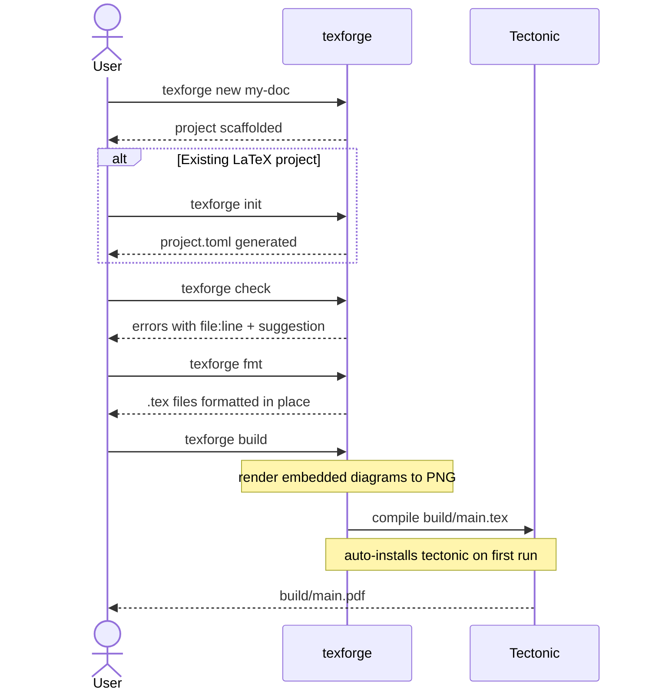

```
 ███████████          █████ █████ ███████████                                     
░█░░░███░░░█         ░░███ ░░███ ░░███░░░░░░█                                     
░   ░███  ░   ██████  ░░███ ███   ░███   █ ░   ██████  ████████   ███████  ██████ 
    ░███     ███░░███  ░░█████    ░███████    ███░░███░░███░░███ ███░░███ ███░░███
    ░███    ░███████    ███░███   ░███░░░█   ░███ ░███ ░███ ░░░ ░███ ░███░███████ 
    ░███    ░███░░░    ███ ░░███  ░███  ░    ░███ ░███ ░███     ░███ ░███░███░░░  
    █████   ░░██████  █████ █████ █████      ░░██████  █████    ░░███████░░██████ 
   ░░░░░     ░░░░░░  ░░░░░ ░░░░░ ░░░░░        ░░░░░░  ░░░░░      ░░░░░███ ░░░░░░  
                                                                 ███ ░███         
                                                                ░░██████          
                                                                 ░░░░░░           
```

[](https://github.com/UniverLab/texforge/actions/workflows/ci.yml)
[](https://github.com/UniverLab/texforge/actions/workflows/release.yml)
[](https://crates.io/crates/texforge)
[](LICENSE)

Texforge is a unified LaTeX workspace — one tool for writing, rendering diagrams (Mermaid, Graphviz), and building PDFs. Set it up once and stay focused on your document.

---

### Demo CLI


---

## Features

- **🚀 One-command setup** — Install once, everything is included (LaTeX engine, templates, diagram renderers).
- **📊 Diagrams as first-class** — Write Mermaid or Graphviz blocks in your `.tex` files; they render and embed during build.
- **🪄 Guided workflows** — Start a new project or migrate an existing one with a guided init.
- **🔎 Template registry** — Install, manage, and validate templates — with built-in fallback for offline work.
- **🔨 Build and live edit** — Compile once or use watch mode; rebuild automatically as you edit.
- **🧭 Smart linting** — Catch missing files, broken references, bibliography keys, and unclosed environments before build.
- **✨ Format on demand** — Normalize `.tex` files with an opinionated formatter (including `--check` mode).
- **🔄 Placeholders and config** — Reuse project details from configuration without retyping.

---

## Installation

### Quick install (recommended)

**Linux / macOS:**

```bash
curl -fsSL https://raw.githubusercontent.com/UniverLab/texforge/main/scripts/install.sh | sh
```

**Windows (PowerShell):**

```powershell
irm https://raw.githubusercontent.com/UniverLab/texforge/main/scripts/install.ps1 | iex
```

This downloads and installs `texforge`. No Rust toolchain required. Tectonic (the LaTeX engine) is installed automatically on first build.

You can customize the install:

```bash
# Pin a specific version
VERSION=0.1.0 curl -fsSL https://raw.githubusercontent.com/UniverLab/texforge/main/scripts/install.sh | sh

# Install to a custom directory
INSTALL_DIR=/usr/local/bin curl -fsSL https://raw.githubusercontent.com/UniverLab/texforge/main/scripts/install.sh | sh
```

```powershell
# Pin a specific version (PowerShell)
$env:VERSION="0.1.0"; irm https://raw.githubusercontent.com/UniverLab/texforge/main/scripts/install.ps1 | iex
```

### Via cargo

```bash
cargo install texforge
```

Tectonic (the LaTeX engine) is installed automatically on first build. No extra steps needed.

Available on [crates.io](https://crates.io/crates/texforge).

### From source

```bash
git clone https://github.com/UniverLab/texforge.git
cd texforge
cargo build --release
# Binary at target/release/texforge
```

### GitHub Releases

Check the [Releases](https://github.com/UniverLab/texforge/releases) page for precompiled binaries (Linux x86_64, macOS x86_64/ARM64, Windows x86_64).

### Uninstall

```bash
rm -f ~/.local/bin/texforge  # texforge binary
rm -rf ~/.texforge/           # tectonic engine + cached templates
```

## Skill

If you want Copilot to understand texforge and help with common LaTeX tasks, install the [texforge Skill](https://skills.sh/jheisonmb/skills/texforge):

```bash
npx skills add https://github.com/jheisonmb/skills --skill texforge
```

### Demo with OpenCode agents


## Quick Start

```bash
# Interactive wizard — new project or migrate existing
texforge init

# Or directly:
texforge new mi-tesis
texforge build
```

## Workflow



## `texforge init`

Interactive wizard. Auto-detects the context:

- If a `.tex` file with `\documentclass` is found in the current directory — migrates the existing project (asks for title and author, generates `project.toml`)
- Otherwise — guides creation of a new project (asks for name and template)

```bash
# Existing LaTeX project
cd mi-tesis-existente/
texforge init

# Empty directory
mkdir mi-nuevo-doc && cd mi-nuevo-doc
texforge init
```

---


| Command | Description |
|---|---|
| `texforge new <name>` | Create new project from template |
| `texforge new <name> -t <template>` | Create with specific template |
| `texforge init` | Interactive wizard — new project or migrate existing |
| `texforge build` | Compile to PDF |
| `texforge build --watch` | Watch for changes and rebuild automatically |
| `texforge clean` | Remove build artifacts |
| `texforge fmt` | Format .tex files |
| `texforge fmt --check` | Check formatting without modifying |
| `texforge check` | Lint without compiling |
| `texforge config` | Interactive wizard to set user details (name, email, institution, language) |
| `texforge config list` | Show all configured values |
| `texforge config <key>` | Show value for key (name, email, institution, language) |
| `texforge config <key> <value>` | Set value for key |
| `texforge template list` | List installed templates |
| `texforge template list --all` | List installed + available in registry |
| `texforge template add <name>` | Download template from registry |
| `texforge template remove <name>` | Remove installed template |
| `texforge template validate <name>` | Verify template compatibility |

---

## Configuration

Global user details stored in `~/.texforge/config.toml`. These are used as replaceable placeholders in templates.

**Interactive setup:**

```bash
texforge config
```

This launches a wizard asking for:
- **Name**: Your full name
- **Email**: Your email address  
- **Institution**: Your institution/organization
- **Language**: Document language (default: `english`)

**Command-line interface:**

```bash
# View all settings
texforge config list

# Get a specific value
texforge config name

# Set a value
texforge config name "Jheison Martinez"
texforge config email "jheison@example.com"
texforge config institution "University of Tech"
texforge config language "spanish"
```

---

## Templates

Templates are managed through the [texforge-templates](https://github.com/UniverLab/texforge-templates) registry. The `general` template is embedded in the binary and works offline. Run `texforge template list --all` to see all available templates.

---

## Diagrams

`texforge build` intercepts embedded diagram environments before compilation. Originals are never modified — diagrams are rendered in `build/` copies.

### Mermaid

```latex
% Default: width=\linewidth, pos=H, no caption
\begin{mermaid}
flowchart LR
  A[Input] --> B[Process] --> C[Output]
\end{mermaid}

% With options
\begin{mermaid}[width=0.6\linewidth, caption=System flow, pos=t]
flowchart TD
  X --> Y --> Z
\end{mermaid}
```

### Graphviz / DOT

```latex
\begin{graphviz}[caption=Pipeline]
digraph G {
  rankdir=LR
  A -> B -> C
  B -> D
}
\end{graphviz}
```

Both rendered to PNG via pure Rust — no browser, no Node.js, no `dot` binary required.

| Option | Default | Description |
|---|---|---|
| `width` | `\linewidth` | Image width |
| `pos` | `H` | Figure placement (`H`, `t`, `b`, `h`, `p`) |
| `caption` | _(none)_ | Figure caption |

---

## Watch Mode

`texforge build --watch` watches for `.tex` file changes and rebuilds automatically:

```bash
texforge build --watch            # rebuild after 2s of inactivity (default)
texforge build --watch --delay 5  # custom delay in seconds
```

The terminal shows a live session timer, build count, and the result of the last build. Press `Ctrl+C` to stop.

---

## Linter

`texforge check` runs static analysis without compiling:

- `\input{file}` — verifies file exists
- `\includegraphics{img}` — verifies image exists
- `\cite{key}` — verifies key exists in `.bib`
- `\ref{label}` / `\label{label}` — verifies cross-reference consistency
- `\begin{env}` / `\end{env}` — detects unclosed environments

```
ERROR [main.tex:47]
  \includegraphics{missing.png} — file not found

ERROR [main.tex:12]
  \cite{smith2020} — key not found in .bib

ERROR [main.tex:23]
  \begin{figure} never closed
  suggestion: Add \end{figure}
```

---

## Formatter

`texforge fmt` applies opinionated formatting inspired by `rustfmt`:

- Consistent indentation (2 spaces) inside environments
- Collapsed multiple blank lines
- Aligned `\begin{}`/`\end{}` blocks

One canonical output regardless of input style. Git diffs stay clean.

```bash
texforge fmt           # format in place
texforge fmt --check   # check without modifying (CI-friendly)
```

---

## Runtime Directory

```
~/.texforge/
  bin/
    tectonic            # LaTeX engine (auto-installed on first build)
  templates/
    general/            # Cached templates
    apa-general/
    ...
```

---

## Platform Support

| Platform | Architecture | Status |
|---|---|---|
| Linux | x86_64 | yes |
| macOS | x86_64 | yes |
| macOS | ARM64 (Apple Silicon) | yes |
| Windows | x86_64 | yes |

---

## Tech Stack

| Concern | Crate |
|---|---|
| CLI parsing | `clap` (derive) |
| Error handling | `anyhow` |
| Serialization | `serde` + `toml` |
| HTTP client | `reqwest` (blocking) |
| Archive extraction | `flate2` + `tar` |
| File traversal | `walkdir` |
| LaTeX engine | `tectonic` (external binary) |
| Mermaid renderer | `mermaid-rs-renderer` |
| Graphviz renderer | `layout-rs` |
| SVG → PNG | `resvg` |

---

## License

MIT

---
## Support

- 📖 [GitHub Issues](https://github.com/UniverLab/texforge/issues) — Report bugs or request features
- 💬 [Discussions](https://github.com/UniverLab/texforge/discussions) — Ask questions
- 🐦 Twitter: [@JheisonMB](https://twitter.com/JheisonMB)

---

Made with ❤️ by [JheisonMB](https://github.com/JheisonMB) and [UniverLab](https://github.com/UniverLab)
